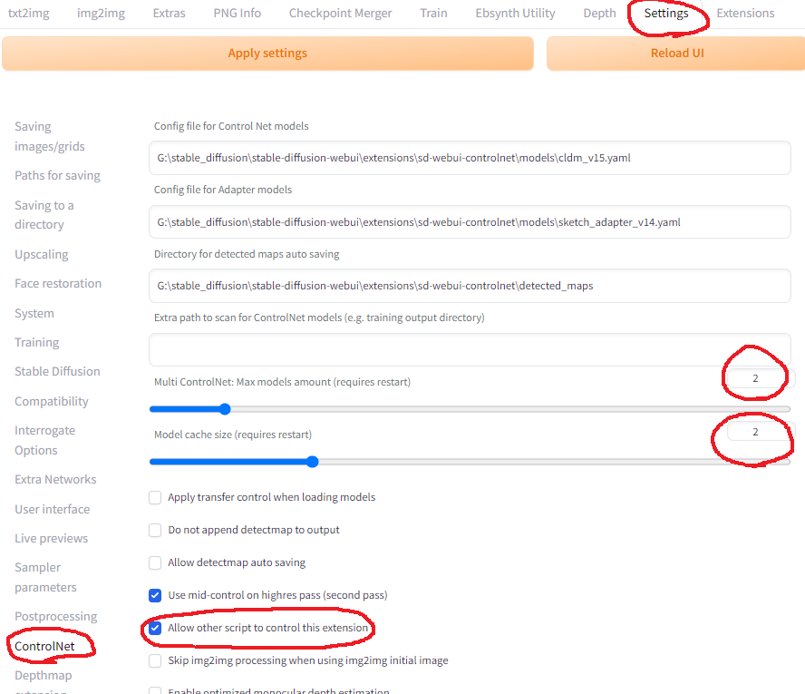
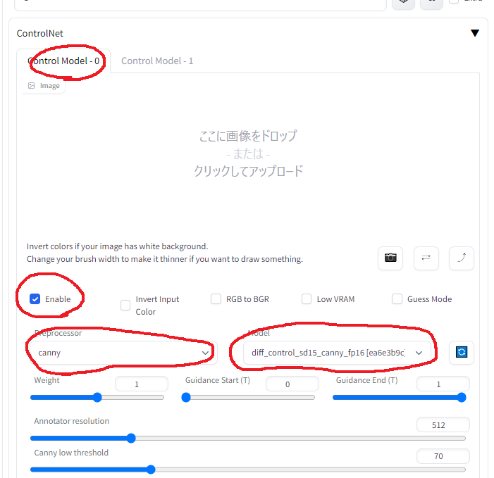
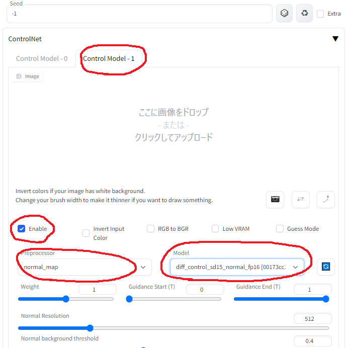
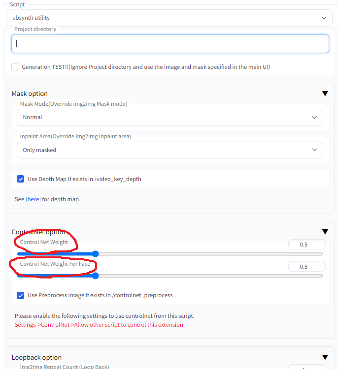
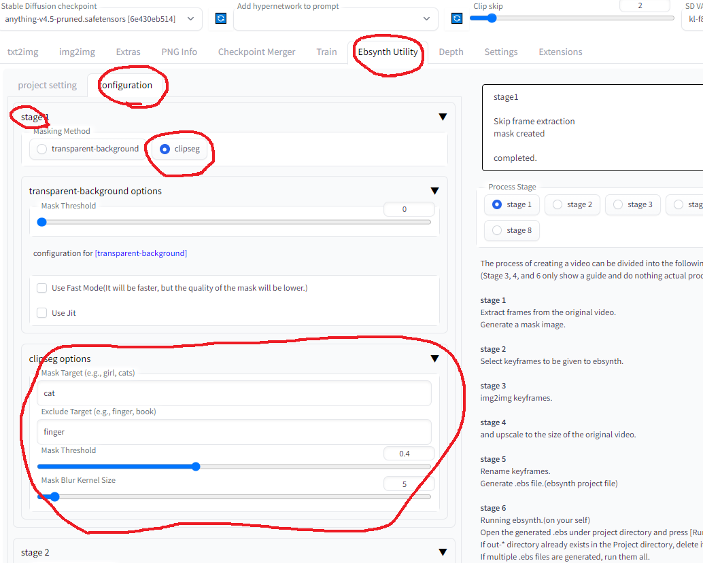

# ebsynth_utility

## Overview
#### AUTOMATIC1111 UI extension for creating videos using img2img and ebsynth.
#### This extension allows you to output edited videos using ebsynth.(AE is not required)

##### With [Controlnet](https://github.com/Mikubill/sd-webui-controlnet) installed, I have confirmed that all features of this extension are working properly!  
##### [Controlnet](https://github.com/Mikubill/sd-webui-controlnet) is a must for video editing, so I recommend installing it.  
##### Multi ControlNet("canny" + "normal map") would be suitable for video editing.  

## Example
- The following sample is raw output of this extension.  
#### sample 1 mask with [clipseg](https://github.com/timojl/clipseg)  
- first from left : original  
- second from left : masking "cat" exclude "finger"  
- third from left : masking "cat head"  
- right : color corrected with [color-matcher](https://github.com/hahnec/color-matcher) (see stage 3.5)  
- Multiple targets can also be specified.(e.g. cat,dog,boy,girl)  

<video controls src="https://user-images.githubusercontent.com/118420657/223008549-167beaee-1453-43fa-85ce-fe3982466c26.mp4" muted="false"></video>

#### sample 2 blend background
- person : masterpiece, best quality, masterpiece, 1girl, masterpiece, best quality,anime screencap, anime style  
- background : cyberpunk, factory, room ,anime screencap, anime style  
- It is also possible to blend with your favorite videos.  

<video controls src="https://user-images.githubusercontent.com/118420657/214592811-9677634f-93bb-40dd-95b6-1c97c8e7bb63.mp4" muted="false"></video>

#### sample 3 auto tagging
- left : original  
- center : apply the same prompts in all keyframes  
- right : apply auto tagging by deepdanbooru in all keyframes  
- This function improves the detailed changes in facial expressions, hand expressions, etc.  
  In the sample video, the "closed_eyes" and "hands_on_own_face" tags have been added to better represent eye blinks and hands brought in front of the face.  

<video controls src="https://user-images.githubusercontent.com/118420657/218247502-6c8e04fe-859b-4739-8c9d-0bf459d04e3b.mp4" muted="false"></video>

#### sample 4 auto tagging (apply lora dynamically)
- left : apply auto tagging by deepdanbooru in all keyframes  
- right : apply auto tagging by deepdanbooru in all keyframes + apply "anyahehface" lora dynamically  
- Added the function to dynamically apply TI, hypernet, Lora, and additional prompts according to automatically attached tags.  
  In the sample video, if the "smile" tag is given, the lora and lora trigger keywords are set to be added according to the strength of the "smile" tag.  
  Also, since automatically added tags are sometimes incorrect, unnecessary tags are listed in the blacklist.  
  [Here](sample/) is the actual configuration file used. placed in "Project directory" for use.  

<video controls src="https://user-images.githubusercontent.com/118420657/218247633-ab2b1e6b-d81c-4f1d-af8a-6a97df23be0e.mp4" muted="false"></video>

 

## Installation
- Install [ffmpeg](https://ffmpeg.org/) for your operating system
  (https://www.geeksforgeeks.org/how-to-install-ffmpeg-on-windows/)
- Install [Ebsynth](https://ebsynth.com/)
- Use the Extensions tab of the webui to [Install from URL]

 
 

## Usage
- Go to [Ebsynth Utility] tab.
- Create an empty directory somewhere, and fill in the "Project directory" field.
- Place the video you want to edit from somewhere, and fill in the "Original Movie Path" field.
  Use short videos of a few seconds at first.
- Select stage 1 and Generate.
- Execute in order from stage 1 to 7.
  Progress during the process is not reflected in webui, so please check the console screen.
  If you see "completed." in webui, it is completed.  
(In the current latest webui, it seems to cause an error if you do not drop the image on the main screen of img2img.  
Please drop the image as it does not affect the result.)  

 
 

## Note 1
For reference, here's what I did when I edited a 1280x720 30fps 15sec video based on
#### Stage 1
There is nothing to configure.  
All frames of the video and mask images for all frames are generated.  
  
#### Stage 2
In the implementation of this extension, the keyframe interval is chosen to be shorter where there is a lot of motion and longer where there is little motion.  
If the animation breaks up, increase the keyframe, if it flickers, decrease the keyframe.  
First, generate one time with the default settings and go straight ahead without worrying about the result.  

  
#### Stage 3
Select one of the keyframes, throw it to img2img, and run [Interrogate DeepBooru].  
Delete unwanted words such as blur from the displayed prompt.  
Fill in the rest of the settings as you would normally do for image generation.  
  
Here is the settings I used.  
- Sampling method : Euler a  
- Sampling Steps : 50  
- Width : 960  
- Height : 512  
- CFG Scale : 20  
- Denoising strength : 0.2  
  
Here is the settings for extension.  
- Mask Mode(Override img2img Mask mode) : Normal
- Img2Img Repeat Count (Loop Back) : 5  
- Add N to seed when repeating : 1
- use Face Crop img2img : True  
- Face Detection Method : YuNet  
- Max Crop Size : 1024  
- Face Denoising Strength : 0.25  
- Face Area Magnification : 1.5 (The larger the number, the closer to the model's painting style, but the more likely it is to shift when merged with the body.)  
- Enable Face Prompt : False  
  
Trial and error in this process is the most time-consuming part.  
Monitor the destination folder and if you do not like results, interrupt and change the settings.  
[Prompt][Denoising strength] and [Face Denoising Strength] settings when using Face Crop img2img will greatly affect the result.  
For more information on Face Crop img2img, check [here](https://github.com/s9roll7/face_crop_img2img)
  
If you have lots of memory to spare, increasing the width and height values while maintaining the aspect ratio may greatly improve results.  
  
This extension may help with the adjustment.  
https://github.com/s9roll7/img2img_for_all_method  

 

**The information above is from a time when there was no controlnet.  
When controlnet are used together (especially multi-controlnets),
Even setting "Denoising strength" to a high value works well, and even setting it to 1.0 produces meaningful results.  
If "Denoising strength" is set to a high value, "Loop Back" can be set to 1.**  

 

#### Stage 4
Scale it up or down and process it to exactly the same size as the original video.  
This process should only need to be done once.  
  
- Width : 1280  
- Height : 720  
- Upscaler 1 : R-ESRGAN 4x+  
- Upscaler 2 : R-ESRGAN 4x+ Anime6B  
- Upscaler 2 visibility : 0.5  
- GFPGAN visibility : 1  
- CodeFormer visibility : 0  
- CodeFormer weight : 0  
  
#### Stage 5
There is nothing to configure.  
.ebs file will be generated.  
  
#### Stage 6
Run the .ebs file.  
I wouldn't change the settings, but you could adjust the .ebs settings.  

#### Stage 7
Finally, output the video.  
In my case, the entire process from 1 to 7 took about 30 minutes.  
  
- Crossfade blend rate : 1.0  
- Export type : mp4  

 
 

## Note 2 : How to use multi-controlnet together  
#### in webui setting  

 
#### In controlnet settings in img2img tab(for controlnet 0)  

 
#### In controlnet settings in img2img tab(for controlnet 1)  

 
#### In ebsynth_utility settings in img2img tab  
**Warning : "Weight" in the controlnet settings is overridden by the following values**

 
 

## Note 3 : How to use clipseg  

